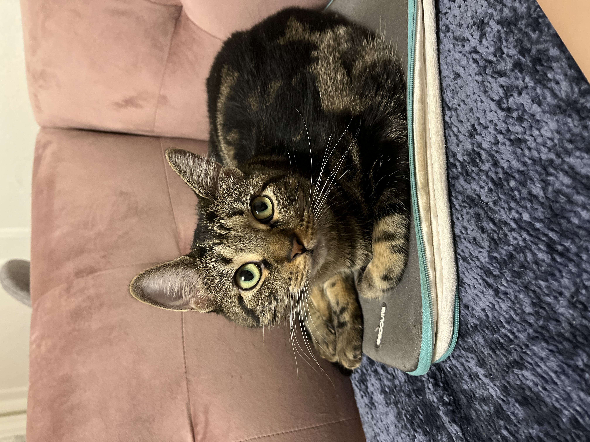

# This is Jeff's awesome website


I use [google](https://www.google.com/) all the time to do data science. 

This is my cat Georgie. 



```{r}
library(tidyverse)

```

Here's a direct link to the about page:
[about](about.html).

